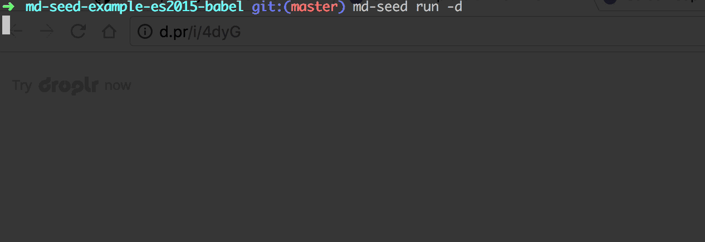

[](https://travis-ci.org/sharvit/mongoose-data-seed)
[](https://coveralls.io/github/sharvit/mongoose-data-seed?branch=master)
[](http://makeapullrequest.com)
[](https://david-dm.org/sharvit/mongoose-data-seed)
[](https://david-dm.org/sharvit/mongoose-data-seed?type=dev)
[](https://github.com/prettier/prettier)
[](https://app.fossa.io/projects/git%2Bgithub.com%2Fsharvit%2Fmongoose-data-seed?ref=badge_shield)
[](http://opensource.org/licenses/MIT)

# mongoose-data-seed

Seed mongodb with data using mongoose models



## Install

```shell
npm install --save mongoose-data-seed
md-seed init
```

`md-seed init` will ask you to choose a folder for your seeders and whether to use ES6/2015 syntax which require babel.

`md-seed init` will create the `seeders` folder, generate `md-seed-config.js` and `md-seed-generator.json`.

## Use

Generate seeder file

```shell
md-seed g users
```

Run all seeders

```shell
md-seed run
```

Or run specific seeders

```shell
md-seed run users posts comments
```

## Options

Drop the database before seeding

```shell
md-seed run --dropdb
```

## Seeder Example

```javascript
import { Seeder } from "mongoose-data-seed";
import { User } from "../server/models";

const data = [
  {
    email: "user1@gmail.com",
    password: "123123",
    password_confirmation: "123123",
    isAdmin: true
  },
  {
    email: "user2@gmail.com",
    password: "123123",
    password_confirmation: "123123",
    isAdmin: false
  }
];

class UsersSeeder extends Seeder {
  async shouldRun() {
    return User.count()
      .exec()
      .then(count => count === 0);
  }

  async run() {
    return User.create(data);
  }
}

export default UsersSeeder;
```

### md-seed-config.js

`md-seed` excepting to get 3 values from `md-seed-config.js`

1. `mongoose` - The mongoose library (so `md-seed` will use the same version as your project)
2. `mongoURL` - Url to your mongodb
3. `seedersList` - A key/value list of all your seeders,
   `md-seed` will run your seeders as they ordered in the list.

#### Example

```javascript
import mongooseLib from "mongoose";
mongooseLib.Promise = global.Promise;

import Users from "./seeders/users.seeder";
import Posts from "./seeders/posts.seeder";
import Comments from "./seeders/comments.seeder";

// Export the mongoose lib
export const mongoose = mongooseLib;

// Export the mongodb url
export const mongoURL =
  process.env.MONGO_URL || "mongodb://localhost:27017/dbname";

/*
  Seeders List
  ------
  order is important
*/
export const seedersList = {
  Users,
  Posts,
  Comments
};
```

## Examples

1. [md-seed-example-es2015-babel](https://github.com/sharvit/mongoose-data-seed/tree/master/examples/md-seed-example-es2015-babel)
2. [md-seed-example-es5](https://github.com/sharvit/mongoose-data-seed/tree/master/examples/md-seed-example-es5)

## License

MIT

[](https://app.fossa.io/projects/git%2Bgithub.com%2Fsharvit%2Fmongoose-data-seed?ref=badge_shield)
[](http://opensource.org/licenses/MIT)
